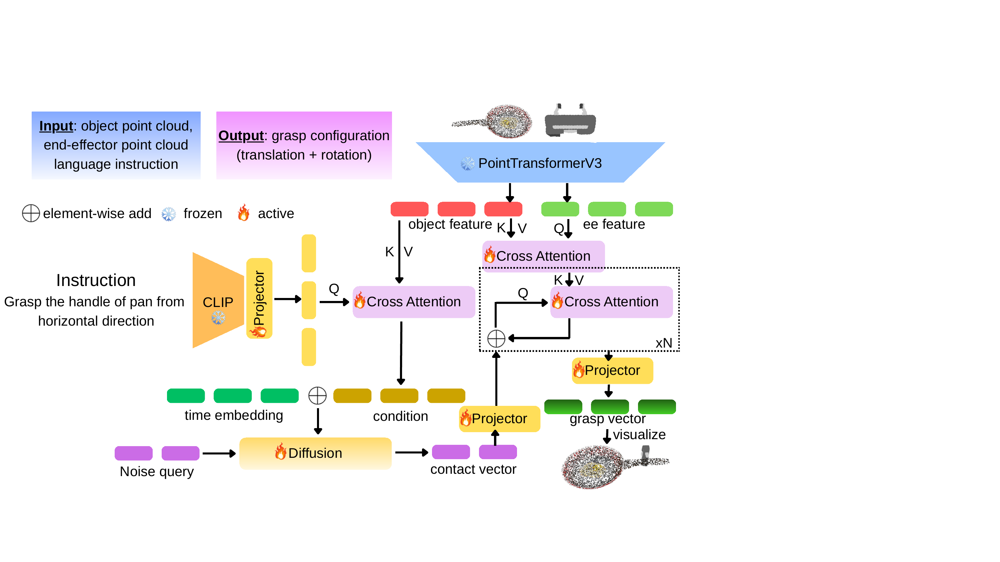

# GRIP: <u>G</u>uided <u>R</u>obotic Prec<u>i</u>se Gras<u>p</u>ing using Human Language Instructions

## Introduction

This is the offical code repository of GRIP. 

## Model Structure
GRIP model structure is shown in following picture.

## Dataset Details
gripper init direction:
  approaching direction is z direction and hand base long axis is x direction

graspgen dataset size: 228958
  - train dataset size: 181944
  - val dataset size: 45580

gpd dataset size: 1670199
  - train dataset size: 1271538
  - val dataset size: 339417

graspnet dataset size: 
  - train dataset size: 5376378
  - val dataset size: 1378102

training dataset scale: 180000
validate dataset scale: 10000

graspgen rotation matrix: 
  col 0: right direction col 1: down direction col 2: forward direction(approaching direction)

Red: X, Green: Y, Blue: Z

gpd and graspnet dataset: scale 0.1 object mesh can be use scale 1.0 object mesh multiple 0.1 to transform, don't fix object mesh center by np.mean(xyz, axis=0)

graspnet and gpd grasp dataset gripper initial state are x axis but graspGen is z axis.

we define gripper orient z axis at initial state.

in graspgen, translation of a grasp is hand tile point but not ee center, but in graspnet and gpd, it's ee center.

ee base and hand tile distance is 0.06m

dataset_grasp:
  grasp_dataset: raw grasp dataset of gpd, graspnet, graspGen
  grasp_filter_dataset: filter semantic label is None data in graspnet and gpd
  selected_grasp_dataset: select 180000 items and 10000 items for training and validating (but num is not 180000, because we average sample in each uuid folder but maybe some folders num is not enough, so there will have overlay grasp)
  
  torch_tensor: grasp_filter_dataset corresponding torch tensor
  selected_torch_tensor: selected_grasp_dataset corresponding torch tensor

  torch_tensor_ptv3object: raw torch tensor for ptv3-object but num is not 180000
  final_torch_tensor_ptv3object: final torch tensor for ptv3-object and graspnet, gpd grasp num is 180000

  