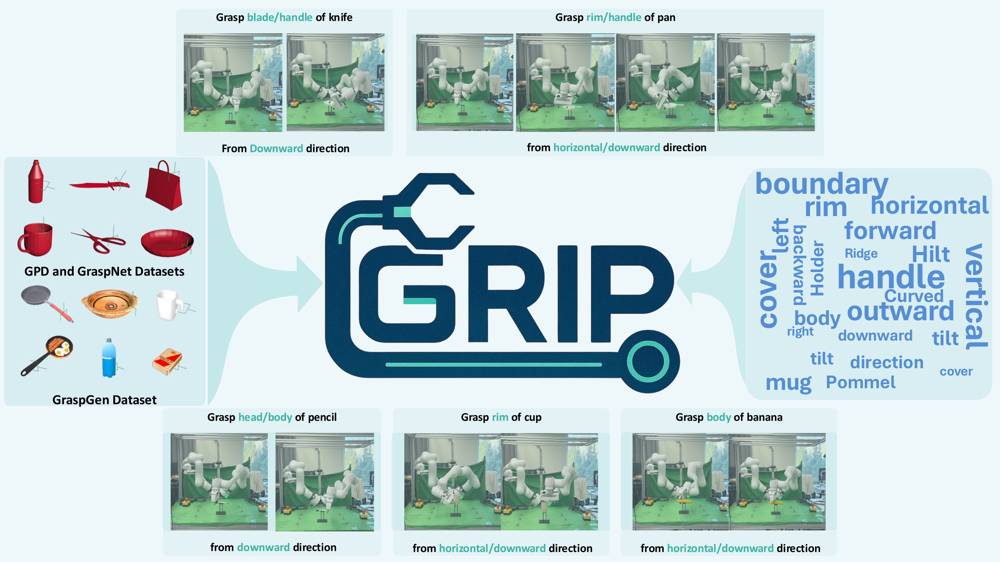
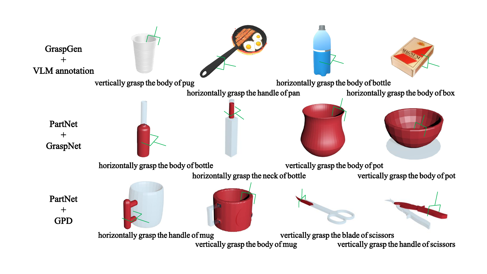

# GRIP: <u>G</u>uided <u>R</u>obotic Prec<u>i</u>se Gras<u>p</u>ing using Human Language Instructions

## Introduction

This is the offical code repository of GRIP. 

## Model Structure
A schematic overview of the GRIP model architecture is presented in the following figure.

## Dataset Details
Selected examples from the grasp pose dataset are visualized in the following figure.

gripper init direction:
  approaching direction is z direction and hand base long axis is x direction

graspgen dataset size: 228958
  - train dataset size: 181944
  - val dataset size: 45580

gpd dataset size: 1670199
  - train dataset size: 1271538
  - val dataset size: 339417

graspnet dataset size: 
  - train dataset size: 5376378
  - val dataset size: 1378102

training dataset scale: 180000
validate dataset scale: 10000
